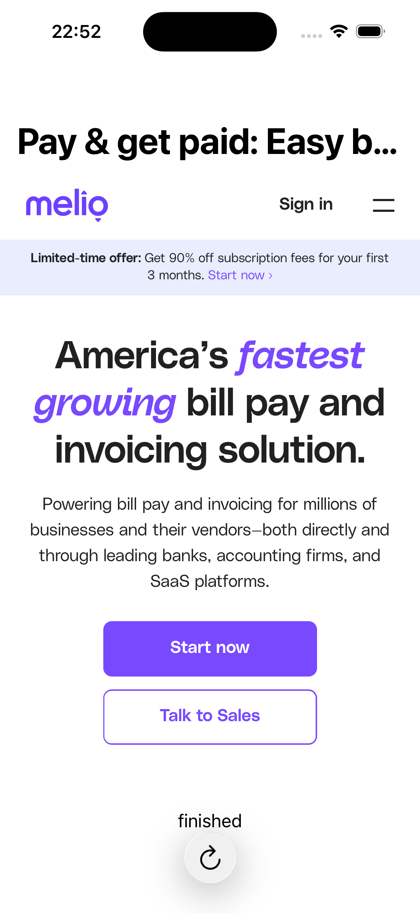

# SwiftUI-WebView Demo

A minimal SwiftUI sample project that embeds **`WKWebView`** in a fully SwiftUI-native interface.  
It is intended as an easy-to-digest reference for anyone bringing web content into their SwiftUI apps without relying on UIKit view controllers.

<p align="center">
  
</p>

---

## ✨ What the demo shows

| Feature | Description |
|---------|-------------|
| **Pure-SwiftUI wrapper** | `WebView` is a lightweight `UIViewRepresentable` that exposes `WKWebView` to SwiftUI while keeping UIKit details hidden. |
| **Observable navigation model** | `WebPage` publishes loading state, title, and `WKNavigation` events so your SwiftUI views update automatically. |
| **Toolbar controls** | A bottom toolbar toggles between **Reload** and **Stop** buttons depending on the loading state. |
| **Live status label** | Displays the most recent navigation event (`committed`, `finished`, `redirect`, etc.). |
| **Configurable URL** | Default start page is <https://meliopayments.com>, but you can load any URL with a single line of code. |

---

## 🚀 Getting started

### Requirements

|                | Minimum |
|----------------|---------|
| Xcode          | 16.0    |
| iOS / iPadOS   | 17.0    |
| Swift          | 5.10    |

### Build & run

```bash
git clone https://github.com/your-username/SwiftUI-WebView-Demo.git
cd SwiftUI-WebView-Demo
open SwiftUI-WebView-Demo.xcodeproj
```

Select **iPhone 15 Pro (or any simulator / device)** and press **Run (⌘R)**.

---

## 🧩 Project structure

```
├─ Sources
│  ├─ WebView.swift     ← UIViewRepresentable wrapper around WKWebView
│  ├─ WebPage.swift     ← ObservableObject that drives navigation state
│  └─ ContentView.swift ← Sample UI demonstrating the wrapper
└─ Docs
   └─ screenshot.png    ← Replace with your own screenshot
```

> **Note**  
> The `WebPage` model handles loading, reloading, stopping, and publishes `currentNavigationEvent` so your UI stays reactive.

---

## 🛠 Customization tips

| Want to… | Change |
|----------|--------|
| **Load a different start page** | Update the URL in `ContentView.onAppear`.<br>`page.load(URLRequest(url: URL(string:"https://example.com")!))` |
| **Add Back / Forward buttons** | Expose `page.canGoBack` / `page.goBack()` and `page.goForward()` from `WebPage` and drop new `ToolbarItem`s in. |
| **Show progress bar** | Observe `webView.estimatedProgress` within `WebPage` and bind it to a `ProgressView`. |
| **Inject custom JavaScript** | Configure the underlying `WKWebViewConfiguration` inside `WebView.makeUIView`. |

---

## 📈 Possible next steps

* ☑️ Progress indicator  
* ☑️ Pull-to-refresh with `RefreshableScrollView`  
* ☑️ Share sheet for the current URL  
* ☑️ Error handling UI (SSL failures, offline, etc.)  
* ☑️ Support for multiple tabs or windows  

Contributions are very welcome!

---

## 🤝 Contributing

1. **Fork** the repo  
2. Create your **feature branch** (`git checkout -b feature/YourAwesomeFeature`)  
3. **Commit** your changes (`git commit -m 'Add amazing feature'`)  
4. **Push** to the branch (`git push origin feature/YourAwesomeFeature`)  
5. Open a **Pull Request**

Please keep PRs focused—small, self-contained improvements are easier to review.

---

## 📜 License

This project is released under the **MIT License**.  
See [`LICENSE`](LICENSE) for details.

---

## 🙏 Credits

Created with ❤️ by **[Your Name]** • Inspired by countless “why isn’t there a simple SwiftUI WebView example?” forum posts.  
Feel free to reach out on Twitter [@yourhandle](https://twitter.com/yourhandle) or GitHub for questions or suggestions!
